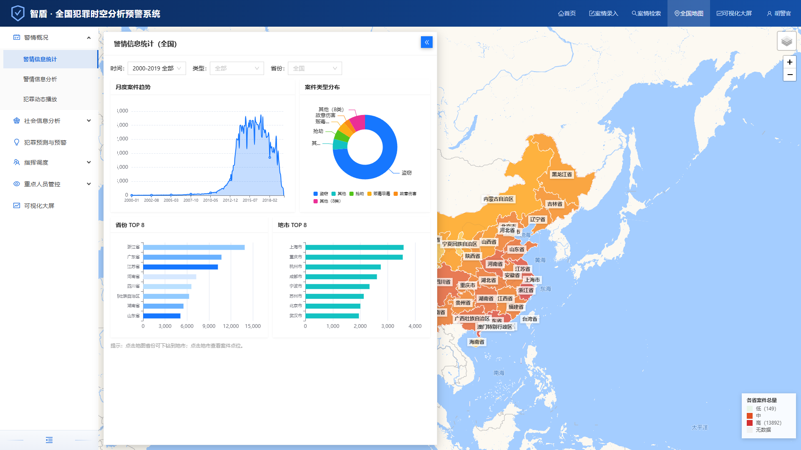

# 智盾 · 全国犯罪时空分析预警系统

> **ZhiDun** — 一个开箱即用的全国犯罪时空分析、预测预警与可视化大屏演示系统（Vue 3 + Node.js）。

基于全国裁判文书公开数据构建的犯罪时空大数据分析平台，覆盖 **31 省 / 372 地市 / 2000–2019 年** 犯罪样本，内置 **SARIMA、STARMA、Prophet、XGBoost** 多模型预测、四色分级预警、城市级犯罪动态播放与指挥调度功能。

[](https://vuejs.org/)
[](https://www.typescriptlang.org/)
[](https://vitejs.dev/)
[](https://nodejs.org/)
[](https://echarts.apache.org/)
[](https://leafletjs.com/)
[](https://github.com/hujinghaoabcd)

---

## 演示截图

| 可视化大屏 | 警情信息统计 |
| --- | --- |
|  |  |

---

## 这个项目解决什么问题

- **看不懂犯罪数据** → 全国省 / 市地图下钻、热力图、年 × 月时空热力、24 小时与星期规律一目了然
- **不知道下月哪里高发** → 多模型预测 + 四色分级预警（红 / 橙 / 黄 / 绿），TOP 区域一键下钻
- **演示 / 教学缺素材** → 内置完整模拟数据与占位生成脚本，`npm run demo` 一条命令跑起来
- **指挥调度无抓手** → 重点区域布控、出警规划、卡口拦截、重点人员积分预警与异常轨迹分析

## 快速开始

> 需要 Node.js 18+

```bash
git clone <your-repo-url> && cd crime
npm install
npm run demo
```

打开 **http://127.0.0.1:8081** 即可体验（后端接口 3000）。

分步启动：

```bash
node server/index.js        # 后端，端口 3000
cd web && npm install && npm run dev   # 前端，端口 8081
```

生产模式：`cd web && npm run build`，将 `web/dist` 同步到根目录 `dist/`，运行 `node server/index.js`，访问 **http://127.0.0.1:3000**。

## 核心功能

- **首页工作台**：全国总览、年度趋势、案件类型分布、TOP 排名、下月预警速览（点击直达）
- **警情信息统计 / 分析**：省 / 市地图下钻、案件点位、热力图、月度趋势、年 × 月时空热力、24 小时与星期发案规律
- **犯罪动态播放**：案件随时间逐月流动动画，支持省级 / 地市级切换与时间轴控制
- **犯罪预测与预警**：SARIMA / STARMA / Prophet / XGBoost 多模型预测、滚动回测精度对比、省级 / 地市级四色预警
- **指挥调度**：重点区域布控（地图标注 + 列表持久化）、出警规划（热点聚类 + 巡逻路线）、卡口拦截
- **重点人员管控**：积分预警、异常轨迹分析
- **社会信息分析**：基础专题、人口、房价、POI 繁华度与犯罪关联分析
- **案情录入 / 检索**：表单录入、多条件筛选、地图查看具体案件
- **可视化大屏**：三栏数据大屏，30 秒自动刷新、全屏、底部案件实时滚动

## 技术栈

| 层 | 技术 |
| --- | --- |
| 前端 | Vue 3 · Vite · TypeScript · Ant Design Vue · Pinia · Vue Router |
| 可视化 | ECharts 5（地图 / 热力 / 图表）· Leaflet 1.9（底图 / 点位）· Leaflet.heat |
| 后端 | Node.js 原生 HTTP（gzip · ETag 缓存 · CORS） |
| 数据 | 全国 31 省 372 地市 2000–2019 犯罪样本（`server/data/`，JSON） |

## 目录结构

```text
.
├── web/          # Vue 3 + Vite + TypeScript 前端源码
├── server/       # Node.js 后端（API / 预测模型 / 模拟数据）
│   ├── data/     # 聚合统计与抽样样本（JSON）
│   └── scripts/  # 数据生成 / 抽取辅助脚本
├── public/       # 前端静态资源（地图 GeoJSON、favicon）
├── screenshots/  # 演示截图
├── dist/         # 生产构建产物（后端直接托管，不入库）
└── package.json  # 一键演示入口
```

## 数据与论文

本项目数据与功能设计参考：

> Zhang Y., Kwan M.-P., Fang L. **An LLM driven dataset on the spatiotemporal distributions of street and neighborhood crime in China**. *Scientific Data*, 2025, 12(1), 467. DOI: [10.1038/s41597-025-04757-8](https://doi.org/10.1038/s41597-025-04757-8)

- 原始论文数据集（约 103 万条）需自行从 Figshare / 作者托管镜像下载（约 7GB，不入库）
- 仓库内置 `server/data/sample.json`（约 12 万条脱敏抽样）与 `server/data/aggregates.json`（全量聚合）
- 未提供真实数据时，运行 `node server/scripts/generate-placeholder.js` 生成占位数据，功能保持一致

## API 概览

所有接口位于 `/api/*`，返回 JSON：

| 接口 | 说明 |
| --- | --- |
| `GET /api/overview` | 全国总览统计（总量 / 省份 / 地市 / 类型 / 时段） |
| `GET /api/cases` | 案件查询（时间、地区、类型筛选） |
| `GET /api/rank` | 省份 / 地市案件排名 |
| `GET /api/predict` | 多模型预测与四色预警 |
| `GET /api/regions` | 省市级联数据 |
| `GET /api/social/*` | 人口、房价、POI 等社会数据 |

## 引用

如果本项目对你的工作有帮助，欢迎引用（仓库已配置 [CITATION.cff](CITATION.cff)，GitHub 会自动显示 **Cite this repository**）：

```bibtex
@software{zhidun-crime-analysis,
  author = {Hu, Jinghao},
  title = {ZhiDun: National Crime Spatiotemporal Analysis and Early Warning System},
  year = {2026},
  url = {https://github.com/hujinghaoabcd}
}
```

## Roadmap

- [x] 全国犯罪时空统计分析
- [x] 多模型预测与四色预警
- [x] 城市级犯罪动态播放
- [x] 可视化大屏（自动刷新 / 全屏）
- [ ] 接入实时 / 增量数据源
- [ ] 模型在线训练与参数调优
- [ ] 多语言国际化

## License

本项目仅用于**技术演示与教学**，所有案件数据均为脱敏模拟数据，不代表任何真实犯罪情况。

如需商用或二次发布，请联系作者获取授权。
