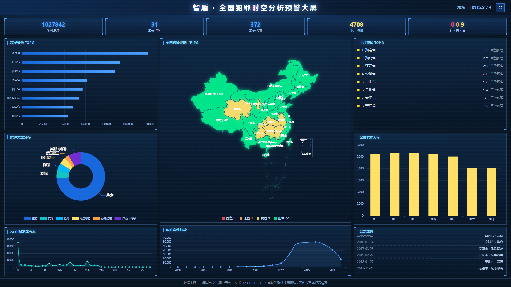

# 智盾 · 全国犯罪时空分析预警系统

> **ZhiDun** — 一个开箱即用的全国犯罪时空分析、预测预警与可视化大屏演示系统（Vue 3 + Node.js）。

基于全国裁判文书公开数据构建的犯罪时空大数据分析平台，覆盖 **31 省 / 372 地市 / 2000–2019 年** 犯罪样本，内置 **SARIMA、STARMA、Prophet、XGBoost** 多模型预测、四色分级预警、城市级犯罪动态播放与指挥调度功能。

[](https://vuejs.org/)
[](https://www.typescriptlang.org/)
[](https://vitejs.dev/)
[](https://nodejs.org/)
[](https://echarts.apache.org/)
[](https://leafletjs.com/)
[](https://github.com/hujinghaoabcd)

---

## 演示截图

| 可视化大屏 | 警情信息统计 |
| --- | --- |
|  |  |

---

## 这个项目解决什么问题

- **看不懂犯罪数据** → 全国省 / 市地图下钻、热力图、年 × 月时空热力、24 小时与星期规律一目了然
- **不知道下月哪里高发** → 多模型预测 + 四色分级预警（红 / 橙 / 黄 / 绿），TOP 区域一键下钻
- **演示 / 教学缺素材** → 内置完整模拟数据与占位生成脚本，`npm run demo` 一条命令跑起来
- **指挥调度无抓手** → 重点区域布控、出警规划、卡口拦截、重点人员积分预警与异常轨迹分析

## 快速开始

> 需要 Node.js 18+

```bash
git clone <your-repo-url> && cd crime
npm install
npm run demo
```

打开 **http://127.0.0.1:8081** 即可体验（后端接口 3000）。

分步启动：

```bash
node server/index.js        # 后端，端口 3000
cd web && npm install && npm run dev   # 前端，端口 8081
```

生产模式：`cd web && npm run build`，将 `web/dist` 同步到根目录 `dist/`，运行 `node server/index.js`，访问 **http://127.0.0.1:3000**。

---

## 功能详解

### 01 · 首页工作台

登录系统后默认进入的一站式总览页，把全国数据压缩到一屏：

- **核心指标卡**：全国案件总量、覆盖省份、覆盖地市、下月预测变化、红 / 橙 / 黄预警数量
- **全国年度发案趋势**：2000–2019 年案件量折线，叠加下月预测点
- **高发省份 TOP 8 / 高发地市 TOP 8**：横向条形排名
- **案件类型分布**：环形饼图
- **下月预警速览**：整行可点击，直接跳转到"犯罪预测与预警"页对应区域
- **预测预警算法说明**：页面内直接展示模型原理、数据口径与免责声明

> 数据说明：数据来源为中国裁判文书网公开判决文书（LLM 提取整理），时间范围 2000–2019，样本为演示抽样，不代表真实犯罪情况。

<div align="center" style="border:1px dashed #c3cede;border-radius:8px;padding:32px 16px;background:#f7f9fc;color:#8a9ab5">
📷 截图占位：<code>screenshots/01-home.png</code>（建议 1920×1080，放入截图后替换此占位块）
</div>

### 02 · 警情信息统计

全国犯罪地图总览，支持从省级一路下钻到案件点位：

- **全国地图**：省份按案件量着色，点击省份下钻到地市，点击地市展示案件点位
- **省份 TOP 8 / 地市 TOP 8**：案件量排名
- **案件类型分布**：类型占比环形图
- **月度案件趋势**：按月统计的案件量折线
- **地图联动筛选**：时间范围、案件类型等筛选条件改变后，地图与图表同步更新


### 03 · 警情信息分析

聚焦发案规律与空间热力：

- **全国犯罪热力图**：Leaflet 热力图层，颜色越红表示发案越密集
- **24 小时发案分布**：一天内发案时段曲线
- **星期发案分布**：一周七天发案量对比
- **年 × 月时空热力（2012–2019）**：年度 × 月份的二维热力矩阵，快速定位高发时段

> 一句话说明：分析发案时段规律与空间热力分布，帮助快速识别高发时段与高发区域。

<div align="center" style="border:1px dashed #c3cede;border-radius:8px;padding:32px 16px;background:#f7f9fc;color:#8a9ab5">
📷 截图占位：<code>screenshots/03-case-analysis.png</code>（建议 1920×1080，放入截图后替换此占位块）
</div>

### 04 · 犯罪动态播放

案件随时间"流动"起来的动画模块：

- **时间轴播放**：按月份逐月播放全国案件分布变化
- **省级 / 地市级切换**：省级看全国格局，城市级看具体城市内部变化
- **当月案件数 / 累计案件数**：播放过程中实时更新
- **月度案件走势**：播放进度与走势图联动
- **城市级动画**：案件点随时间在城市地图上出现、流动、消散

<div align="center" style="border:1px dashed #c3cede;border-radius:8px;padding:32px 16px;background:#f7f9fc;color:#8a9ab5">
📷 截图占位：<code>screenshots/04-crime-animation.png</code>（建议 1920×1080，放入截图后替换此占位块）
</div>

### 05 · 社会信息分析

把犯罪数据与社会经济数据放一起看，共 4 个子模块：

**05a · 基础专题分析**

基于全国裁判文书样本做空间统计，回答"案件到底集中在哪"：

- 城市集中度（TOP8 城市集中度）、TOP1 省份占比
- 城市规模-案件相关系数（规模效应）
- 省份案件规模 TOP 15、高发城市集中度
- 城市数量与案件规模（空间规模效应）散点

<div align="center" style="border:1px dashed #c3cede;border-radius:8px;padding:32px 16px;background:#f7f9fc;color:#8a9ab5">
📷 截图占位：<code>screenshots/05-social-basic.png</code>（建议 1920×1080，放入截图后替换此占位块）
</div>

**05b · 人口数据分析**

人口数据采用第七次人口普查各省常住人口（万人），与裁判文书案件样本做相关性分析：

- 人口-案件相关系数、平均每万人案件数、发案率最高省份
- 人口规模 vs 案件规模对比图、每万人发案率 TOP 10

<div align="center" style="border:1px dashed #c3cede;border-radius:8px;padding:32px 16px;background:#f7f9fc;color:#8a9ab5">
📷 截图占位：<code>screenshots/06-social-people.png</code>（建议 1920×1080，放入截图后替换此占位块）
</div>

**05c · 房价水平分析**

房价为各省级行政区公开均价的近似值（万元 / ㎡），用于演示房价与街头犯罪的关系：

- 房价-案件相关系数、房价最高省份、案件峰值省份
- 房价与案件呈倒 U 形：超高房价地区（京沪）治安投入高、发案相对受控；中等房价的人口流入大省（广东、浙江、山东）案件最集中
- 房价 TOP 10 与案件规模对比

<div align="center" style="border:1px dashed #c3cede;border-radius:8px;padding:32px 16px;background:#f7f9fc;color:#8a9ab5">
📷 截图占位：<code>screenshots/07-social-house.png</code>（建议 1920×1080，放入截图后替换此占位块）
</div>

**05d · POI 繁华度分析**

繁华度指数为演示近似值（综合人口与城市规模），分析商业繁华度与街头犯罪的关系：

- 繁华度-案件相关系数、繁华度最高省份、案件最高省份
- 繁华度 TOP 10 与案件规模对比
- 结论：公共服务设施密度（POI）与街头犯罪呈正相关，建议对 POI 指数高的地区加密巡逻与视频布控

<div align="center" style="border:1px dashed #c3cede;border-radius:8px;padding:32px 16px;background:#f7f9fc;color:#8a9ab5">
📷 截图占位：<code>screenshots/08-social-poi.png</code>（建议 1920×1080，放入截图后替换此占位块）
</div>

### 06 · 犯罪预测与预警

系统的核心模块，用多模型对未来一个月犯罪态势做预测并给出四色预警：

- **预测粒度**：省级（全国 31 省）或地市级（选择省份后下钻到各地市）
- **多模型联动**：SARIMA、STARMA、Prophet、XGBoost 四个模型并发计算，动画展示联动过程（约 15 秒），完成后输出集成预测（加权平均）
- **四色预警**：红色 / 橙色 / 黄色 / 正常四级，地图与图例联动
- **预警 TOP 5**：点击任意区域查看该地历史-预测曲线
- **多模型对比（2018 年滚动回测）**：各模型精度对比表格，可切换地图模型（集成 / 单模型）
- **指标**：预测案件数、年度变化、环比变化、回测精度

<div align="center" style="border:1px dashed #c3cede;border-radius:8px;padding:32px 16px;background:#f7f9fc;color:#8a9ab5">
📷 截图占位：<code>screenshots/09-predict.png</code>（建议 1920×1080，放入截图后替换此占位块）
</div>

### 07 · 指挥调度

**07a · 重点区域布控**

把预警区域变成可执行的布控任务：

- **预警区域列表**：分页展示（每页 5 条），布控后在地图上以标注形式固定显示
- **地图同步下钻**：选择省份后地图下钻到地市级四色预警
- **布控持久化**：布控状态写入本地服务端文件，刷新 / 重启不丢失
- 支持解除布控

<div align="center" style="border:1px dashed #c3cede;border-radius:8px;padding:32px 16px;background:#f7f9fc;color:#8a9ab5">
📷 截图占位：<code>screenshots/10-area-control.png</code>（建议 1920×1080，放入截图后替换此占位块）
</div>

**07b · 出警规划**

与重点区域布控联动，自动生成巡逻方案：

- 选择省份 / 城市，基于布控区域与样本案件识别热点
- **热点列表（按案件数排序）**、可调度派出所
- **推荐巡逻路线**：依次连接高发区域，建议巡逻车数量与轮换方案（如"建议 2 辆巡逻车分南北两段执行，每 2 小时轮换一次"）
- 热点列表与巡逻路线均可折叠

<div align="center" style="border:1px dashed #c3cede;border-radius:8px;padding:32px 16px;background:#f7f9fc;color:#8a9ab5">
📷 截图占位：<code>screenshots/11-planning.png</code>（建议 1920×1080，放入截图后替换此占位块）
</div>

**07c · 卡口拦截**

与布控区域联动，管理卡口布防与拦截记录：

- 加载城市卡口点位，卡口总数 / 繁忙卡口 / 今日拦截记录统计
- 卡口可标记"重点布防"
- **拦截记录（演示）**：模拟拦截 1 条，车牌与人员均为随机演示数据

<div align="center" style="border:1px dashed #c3cede;border-radius:8px;padding:32px 16px;background:#f7f9fc;color:#8a9ab5">
📷 截图占位：<code>screenshots/12-checkpoint.png</code>（建议 1920×1080，放入截图后替换此占位块）
</div>

### 08 · 重点人员管控

**08a · 重点人员积分预警**

演示人员风险积分预警流程（人员数据为脱敏模拟数据，接入实名数据后替换即可）：

- 重点人员列表：姓名（脱敏）、风险积分、最后出现时间
- 高风险 / 中高风险分级标签

<div align="center" style="border:1px dashed #c3cede;border-radius:8px;padding:32px 16px;background:#f7f9fc;color:#8a9ab5">
📷 截图占位：<code>screenshots/13-integral-warning.png</code>（建议 1920×1080，放入截图后替换此占位块）
</div>

**08b · 重点人员异常轨迹分析**

对高风险人员近 7 天活动轨迹做时空聚类（轨迹为演示模拟数据）：

- 选择城市，地图展示异常人员的 7 天活动轨迹，颜色随风险等级变化
- 自动识别异常模式：夜间跨区频繁移动、出现在高发案区域、短时间内多卡口往返等
- 当前城市异常人员统计与列表（姓名脱敏、风险积分、异常模式）

<div align="center" style="border:1px dashed #c3cede;border-radius:8px;padding:32px 16px;background:#f7f9fc;color:#8a9ab5">
📷 截图占位：<code>screenshots/14-trajectory.png</code>（建议 1920×1080，放入截图后替换此占位块）
</div>

### 09 · 案情管理

**09a · 案情录入**

录入一条新案件并写入本地服务端文件（重启不丢失）：

- 案件编号、案件类型、发案日期 / 时间、承办法院
- 省份 / 地市级联选择（自动匹配地市中心坐标）
- 录入警员、案发地点、案件描述
- 提交后可在案情检索中查到并在地图上查看

<div align="center" style="border:1px dashed #c3cede;border-radius:8px;padding:32px 16px;background:#f7f9fc;color:#8a9ab5">
📷 截图占位：<code>screenshots/15-case-input.png</code>（建议 1920×1080，放入截图后替换此占位块）
</div>

**09b · 案情检索**

在全国裁判文书样本 + 本地录入案件中检索：

- 多条件筛选：案件编号 / 类型 / 时间 / 地区等
- 案件详情查看、删除（仅限本地录入案件，删除有二次确认）
- **在地图上查看**：地图只显示底图与案件点位，不受热力图遮挡

<div align="center" style="border:1px dashed #c3cede;border-radius:8px;padding:32px 16px;background:#f7f9fc;color:#8a9ab5">
📷 截图占位：<code>screenshots/16-case-search.png</code>（建议 1920×1080，放入截图后替换此占位块）
</div>

### 10 · 可视化大屏

面向大屏场景的总览页，深蓝科技风三栏布局：

- **KPI 行**：案件总量、覆盖省份、覆盖地市、下月预测、红 / 橙 / 黄预警数
- **左栏**：高发省份 TOP 8、案件类型分布、24 小时发案分布
- **中栏**：全国四色预警地图（霓虹配色、九段线完整）、年度案件趋势
- **右栏**：下月预警 TOP 8、星期发案分布、最新案件滚动
- **自动刷新**：每 30 秒重新拉取数据
- **全屏按钮**：右上角一键全屏
- 底部数据来源与免责声明


---

## 如何补充截图

以上功能详解中的占位块（灰色虚线框）即为截图位置：

1. 按各模块说明完成操作，浏览器窗口建议 **1920×1080**
2. 截图保存到 `screenshots/` 目录，文件名与占位块中的 `<code>` 一致（例如 `screenshots/01-home.png`）
3. 将 README 中对应的占位块替换为：

```markdown

```

## 技术栈

| 层 | 技术 |
| --- | --- |
| 前端 | Vue 3 · Vite · TypeScript · Ant Design Vue · Pinia · Vue Router |
| 可视化 | ECharts 5（地图 / 热力 / 图表）· Leaflet 1.9（底图 / 点位）· Leaflet.heat |
| 后端 | Node.js 原生 HTTP（gzip · ETag 缓存 · CORS） |
| 数据 | 全国 31 省 372 地市 2000–2019 犯罪样本（`server/data/`，JSON） |

## 目录结构

```text
.
├── web/          # Vue 3 + Vite + TypeScript 前端源码
├── server/       # Node.js 后端（API / 预测模型 / 模拟数据）
│   ├── data/     # 聚合统计与抽样样本（JSON）
│   └── scripts/  # 数据生成 / 抽取辅助脚本
├── public/       # 前端静态资源（地图 GeoJSON、favicon）
├── screenshots/  # 演示截图
├── dist/         # 生产构建产物（后端直接托管，不入库）
└── package.json  # 一键演示入口
```

## 数据与论文

本项目数据与功能设计参考：

> Zhang Y., Kwan M.-P., Fang L. **An LLM driven dataset on the spatiotemporal distributions of street and neighborhood crime in China**. *Scientific Data*, 2025, 12(1), 467. DOI: [10.1038/s41597-025-04757-8](https://doi.org/10.1038/s41597-025-04757-8)

- 原始论文数据集（约 103 万条）需自行从 Figshare / 作者托管镜像下载（约 7GB，不入库）
- 仓库内置 `server/data/sample.json`（约 12 万条脱敏抽样）与 `server/data/aggregates.json`（全量聚合）
- 未提供真实数据时，运行 `node server/scripts/generate-placeholder.js` 生成占位数据，功能保持一致

## API 概览

所有接口位于 `/api/*`，返回 JSON：

| 接口 | 说明 |
| --- | --- |
| `GET /api/overview` | 全国总览统计（总量 / 省份 / 地市 / 类型 / 时段） |
| `GET /api/cases` | 案件查询（时间、地区、类型筛选） |
| `GET /api/rank` | 省份 / 地市案件排名 |
| `GET /api/predict` | 多模型预测与四色预警 |
| `GET /api/regions` | 省市级联数据 |
| `GET /api/social/*` | 人口、房价、POI 等社会数据 |

## 引用

如果本项目对你有帮助，欢迎引用（仓库已配置 [CITATION.cff](CITATION.cff)，GitHub 会自动显示 **Cite this repository**）：

```bibtex
@software{zhidun-crime-analysis,
  author = {Hu, Jinghao},
  title = {ZhiDun: National Crime Spatiotemporal Analysis and Early Warning System},
  year = {2026},
  url = {https://github.com/hujinghaoabcd}
}
```

## Roadmap

- [x] 全国犯罪时空统计分析
- [x] 多模型预测与四色预警
- [x] 城市级犯罪动态播放
- [x] 可视化大屏（自动刷新 / 全屏）
- [ ] 接入实时 / 增量数据源
- [ ] 模型在线训练与参数调优
- [ ] 多语言国际化

## License

本项目仅用于**技术演示与教学**，所有案件数据均为脱敏模拟数据，不代表任何真实犯罪情况。

如需商用或二次发布，请联系作者获取授权。
